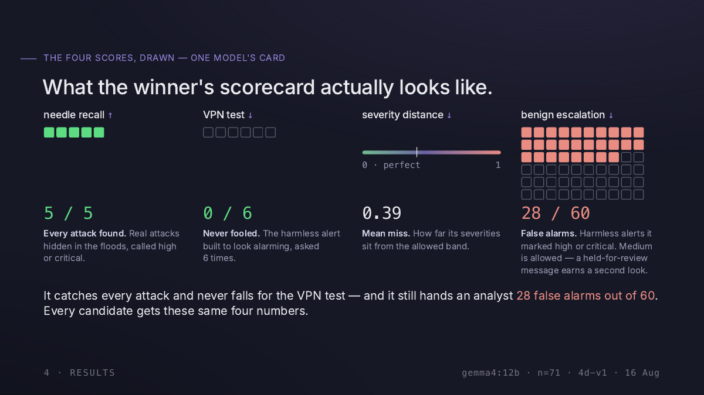
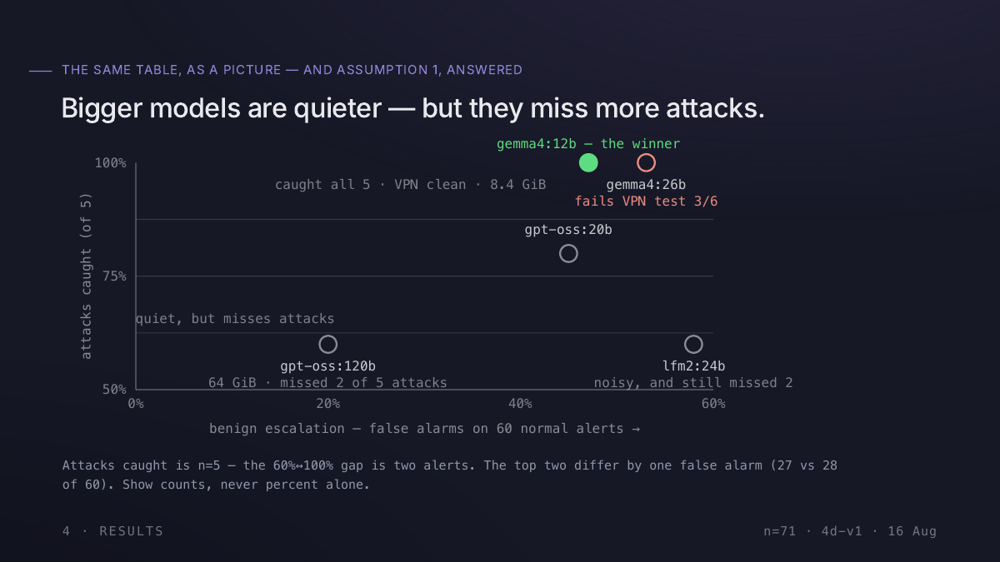
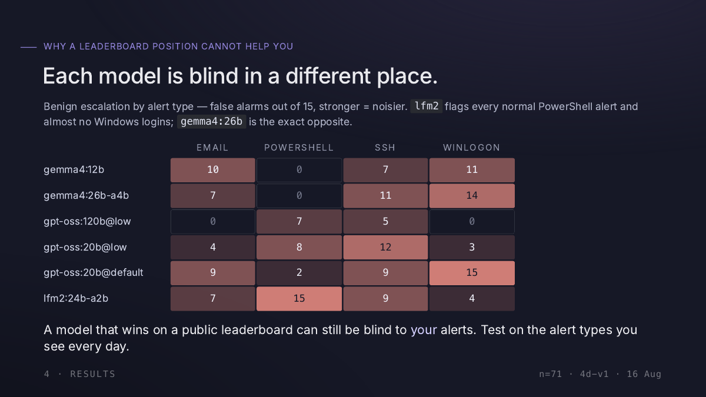
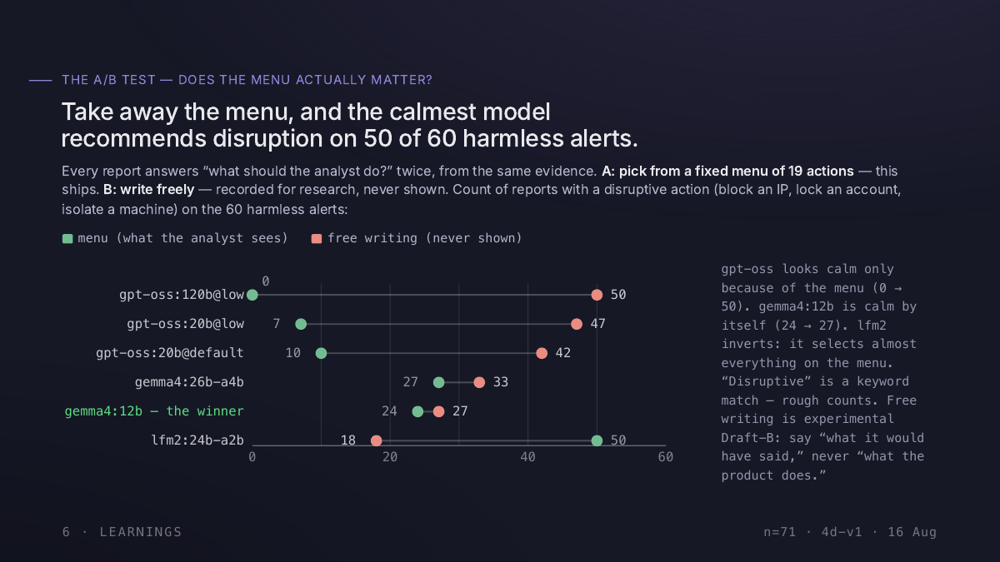

# Local SIEM Agent

A local AI agent that investigates and triages SIEM alerts and produces an enriched report — summary, risk assessment, recommended actions, and an explicit uncertainty note — for a human security analyst to review. The agent is **strictly read-only**: it never takes remediation action, and its only output is a report. The LLM runs entirely on-device (Ollama) — no alert data or logs are sent to any cloud LLM API.

Wazuh is the only SIEM connector today. The pipeline talks to the SIEM through a small `SIEMConnector` Protocol, so a second SIEM is one new class, not a rewrite.

This is a prototype/POC, not connected to production SIEM data. See `ARCHITECTURE.md` for the full design document and rationale, `ROADMAP.md` for what's built vs. planned, and `docs/PROGRESS.md` for current status, test counts, and known issues.

## How it works, in brief

A deterministic 9-step pipeline (the "Agentic Analyst") investigates one alert at a time:

1. Ingest & parse the alert
2. Extract indicators (IPs, hashes, domains, URLs) via regex + LLM assistance
3. Enrich indicators against AbuseIPDB / VirusTotal (if configured)
4. Gather host/rule context from Wazuh
5. Correlate against recent related alerts
6. Assess risk (severity, confidence, rationale)
7. Draft the report (canonical + an experimental FP/TP triage verdict)
8. Self-check the draft against the evidence gathered
9. Finalize and persist the report

At every point the LLM makes a decision, it's constrained to a closed schema (an enum, a fixed set of options) — never a free-form choice — so a small local model can't hallucinate its way into bad output. See `ARCHITECTURE.md` §4 for the full design.

---

## Which model, and why

Sixteen local-model configurations were benchmarked on this exact pipeline before one was picked (Aug 2026): 602 investigations, zero crashes, every one scored on the `severity` its report emits. Each model gets the same four numbers. This is the winner's card:



Five finalists then ran the full corpus, 71 investigations each, on a 128 GB Mac Studio at `num_ctx=8192`:

| model | benign esc.↓ | needle↑ | VPN test↓ | sev. distance↓ | median | footprint |
|---|---|---|---|---|---|---|
| `gpt-oss:120b`@low | **20%** (12/60) | 60% | 0/6 | **0.20** | 35s | 64.0 GiB |
| `gpt-oss:20b`@low | 45% (27/60) | 80% | 0/6 | 0.39 | **24s** | 12.0 GiB |
| **`gemma4:12b`** | 47% (28/60) | **100%** | **0/6** | 0.39 | 259s | **8.4 GiB** |
| `gemma4:26b-a4b-it-qat` | 53% (32/60) | **100%** | **3/6** | 0.49 | 155s | 15.0 GiB |
| `lfm2:24b-a2b` | 58% (35/60) | 60% | 0/6 | 0.52 | **10s** | 14.0 GiB |



**`gemma4:12b` is the only configuration that catches every hidden attack *and* leaves the VPN false-positive control alone, at the smallest footprint.** The runner-up is one false alarm quieter and eleven times faster, and misses one attack. The cost of the pick is latency: p50 259s, p95 462s, worst case 648s on the Studio, slower on the 24 GB laptop this was designed for, and the reasoning-effort setting barely moves it.

Four things the table cannot tell you:

- **Each model is blind in a different place.** False alarms out of 15 per alert type. A public leaderboard position does not transfer to the alert classes you actually see.

  

- **The action menu does more work than the model's judgement.** Every report picks its recommended actions twice from the same evidence: from a closed catalogue of 19 (what ships) and, separately, writing freely (recorded, never shown). On the 60 harmless alerts, `gpt-oss:120b` recommended a disruptive action (block an IP, lock an account, isolate a host) in 0 reports with the menu and 50 without it. The pick was calm either way, 24 against 27. A closed vocabulary constrains what can be said without converging what is said.

  

- **More reasoning made it worse, in the dangerous direction.** `gpt-oss:20b` at default effort against `low`: benign escalation 45% → 58%, the VPN control from 0/6 wrong to 6/6 wrong, needle recall unchanged, 2.7× the latency. The state graph already supplies the grounding; extra reasoning gives the model room to argue itself out of it.
- **The self-check flag is the best quality signal the pipeline has, and the model's stated confidence is the worst.** On the pick, flagged reports were 25% correct on severity and unflagged ones 74%, so `needs_human_review` is a real triage decision. Meanwhile `high` confidence was *less* accurate than `medium`.

**What this does not show.** The corpus is synthetic and self-authored (182 alerts, 130 graded, four alert classes), five needles and six control runs are small denominators, enrichment was off so API quotas could not skew the ranking, and it is one sweep on hardware far larger than the target. And 47% benign escalation means roughly half of ordinary alerts still get flagged high: fine for demonstrating the pipeline, not for running a queue.

Full write-up in [`docs/PROGRESS.md`](docs/PROGRESS.md#local-model-selection-benchmark-1415-aug-2026); methodology in the [design spec](docs/superpowers/specs/2026-08-14-local-model-selection-benchmark-design.md). Raw runs and `runs.csv` are committed under `bench/results/`; `./bench/sweep.sh` reruns it. Figures are from the project's talk deck.

---

## Prerequisites

| Requirement | Notes |
|---|---|
| **Python 3.11+** | |
| **Ollama**, running locally (`ollama serve`) | Must serve a **GGUF-format** model — MLX-tagged builds silently ignore structured-output constraints and will produce garbage results (confirmed empirically, see `docs/PROGRESS.md`). |
| A **GGUF chat model** pulled into Ollama | Project default: `gemma4:12b` (Q4_K_M). Run `ollama pull gemma4:12b` (not `gemma4:12b-mlx`). |
| **A Wazuh deployment** (manager + indexer), reachable over HTTPS | For local development, `wazuh_deployment/single-node/` in this repo brings up a full Docker Compose stack with seeded demo alerts — see [Setting up Wazuh](#setting-up-wazuh-local-demo-stack) below. Any Wazuh 4.x install works, provided you have indexer and manager credentials. |
| **Docker with Compose v2** | Only needed if using the bundled demo Wazuh stack. |
| AbuseIPDB / VirusTotal API keys | Optional. Without them, indicator enrichment is skipped gracefully (no crash) — alerts are still investigated, just without third-party reputation lookups. |

Approximate memory budget if Wazuh and Ollama run on the same machine (see `ARCHITECTURE.md` §7.1): ~4–6GB OS baseline, ~3–6GB for the Wazuh stack (indexer JVM heap is capped at 1GB in the bundled demo compose file), ~8GB for `gemma4:12b` under Ollama. 24GB total is comfortable for this POC's scale.

---

## Installation

```bash
git clone https://github.com/u9u-p/local_siem_agent.git
cd local_siem_agent

python3 -m venv .venv
source .venv/bin/activate
pip install -e ".[dev]"
```

Copy the environment template and fill in real values:

```bash
cp .env.example .env
```

| Variable | Default | Notes |
|---|---|---|
| `DATABASE_PATH` | `./data/alerts.db` | SQLite file — created automatically on first use. |
| `REPORTS_DIR` | `./data/reports` | Each investigated alert's report is also written here as JSON, alongside the SQLite copy. |
| `LOG_LEVEL` | `INFO` | |
| `ABUSEIPDB_API_KEY` | *(empty)* | Optional — enables IP reputation enrichment. |
| `VIRUSTOTAL_API_KEY` | *(empty)* | Optional — enables domain/hash/URL reputation enrichment. |
| `WAZUH_INDEXER_URL` | *(empty)* | e.g. `https://localhost:9200`. **Required** for `pull-alerts`/`investigate-all`/`investigate-one`. |
| `WAZUH_INDEXER_USERNAME` / `WAZUH_INDEXER_PASSWORD` | *(empty)* | |
| `WAZUH_MANAGER_URL` | *(empty)* | e.g. `https://localhost:55000`. |
| `WAZUH_MANAGER_USERNAME` / `WAZUH_MANAGER_PASSWORD` | *(empty)* | |
| `WAZUH_VERIFY_SSL` | `false` | Demo Wazuh deployments use self-signed certs — leave `false` for local use, set `true` before pointing at anything else. |
| `LLM_BASE_URL` | `http://localhost:11434/v1/` | Ollama's OpenAI-compatible endpoint. |
| `LLM_MODEL` | `gemma4:12b` | Must be a GGUF build, see Prerequisites. |
| `LLM_TIMEOUT_SECONDS` | `120` | |

`.env` is gitignored — never commit real credentials.

---

## Setting up Wazuh (local demo stack)

The repo includes a ready-to-run Wazuh Docker Compose stack under `wazuh_deployment/single-node/`, pre-seeded with 112 synthetic demo alerts (SSH auth, VPN, Windows Security events, Mimecast email security, Sysmon, and a 41-alert flood of encoded-PowerShell executions from AI developer tooling) — including deliberate false-positive/true-positive pairs, useful for exercising the agent's investigation logic. Full details, credentials, and troubleshooting are in **`wazuh_deployment/single-node/README.md`** — the short version:

```bash
cd wazuh_deployment/single-node

# One-time (or whenever config/certs.yml changes): generate TLS certs
docker compose -f generate-indexer-certs.yml run --rm generator

# Start the stack (first boot takes ~1 minute)
docker compose up -d
```

Then point `.env`'s `WAZUH_*` variables at `https://localhost:9200` (indexer) and `https://localhost:55000` (manager) using the credentials documented in that sub-README.

If you already have a Wazuh deployment elsewhere, skip this section entirely and just fill in `.env` with its real indexer/manager URLs and credentials.

---

## Usage

Once `ollama serve` is running with the configured model pulled, and `.env` is filled in, the CLI is available either as `agent <command>` (after `pip install -e .`) or `python -m app.cli <command>`.

### Pull alerts from Wazuh

```bash
agent pull-alerts                                  # since the latest stored alert, or 24h ago if empty
agent pull-alerts --since 2026-08-01T00:00:00+00:00 --limit 200
```

Re-pulled alerts are de-duplicated: `alert_id` is derived from the SIEM's own alert id, so a repeated pull (or an overlapping `--since` window) reports the alerts as already stored rather than re-inserting and re-investigating them.

### Add an alert manually (no live Wazuh needed)

Useful for testing or demos — reads a raw Wazuh `_source`-shaped JSON document (the same shape a real Wazuh indexer document has), not this project's internal schema:

```bash
agent add-alert path/to/alert.json
```

### Investigate alerts

```bash
agent investigate-all                 # every alert currently in NEW status
agent investigate-one <alert-id>      # one specific alert, regardless of its current status
```

Each investigation takes minutes, not seconds: with `gemma4:12b` the benchmark measured a median of 259s per alert and a p95 of 462s on a 128 GB Mac Studio (see [Which model, and why](#which-model-and-why)). It produces a report, persisted both to SQLite and as a JSON file under `REPORTS_DIR`.

### Browse alerts and reports

```bash
agent list-alerts                           # all alerts, most recent first
agent list-alerts --status new --limit 20
agent list-reports
agent list-reports --min-severity high
agent show-report <report-id>               # human-readable
agent show-report <report-id> --json        # raw JSON
```

Run `agent --help` or `agent <command> --help` for the full option list on any command.

---

## Running tests

```bash
pytest -v
```

Most tests are pure unit/fake-based and always run. A handful of **live** tests (tagged, skippable) exercise the real Wazuh connection and the real Ollama model — they run automatically when `.env` has working `WAZUH_*` credentials and `LLM_MODEL` is reachable via `ollama serve`; otherwise they skip cleanly rather than failing.

---

## Project structure

```
app/
├── agent/        # the deterministic state-graph ("Agentic Analyst") and its LLM prompts/schemas
├── enrichment/    # AbuseIPDB / VirusTotal providers, rate limiting, indicator validation
├── integration/   # WazuhConnector (indexer + manager), auth strategies
├── llm/           # LLMClient Protocol + Ollama implementation
├── storage/       # SQLite-backed AlertStore
├── wiring.py      # builds real dependencies from Settings
├── report_export.py
├── cli.py         # the typer CLI
└── config.py      # Settings (pydantic-settings, reads .env)
tests/             # pytest suite, mirrors the app/ layout
wazuh_deployment/  # local demo Wazuh Docker Compose stack (see its own README)
docs/
├── PROGRESS.md    # build log: measurements, known risks, lessons per phase
├── app_requirement.md
└── superpowers/   # design specs and implementation plans, one pair per phase
ARCHITECTURE.md    # the design document
ROADMAP.md         # phases, built vs. deferred
CLAUDE.md          # instructions for Claude Code sessions in this repo
```

## How this was built

This repo was built with Claude Code, and the trail is kept on purpose. Each phase went brainstorm → design spec → implementation plan → code, and every spec/plan pair is in `docs/superpowers/`. `docs/PROGRESS.md` is the running log of what was measured along the way — model comparisons, latency, the verdicts that turned out wrong — and `CLAUDE.md` is the instruction file those sessions read. Treat them as the working notes of a prototype, not as polished documentation.

## Further reading

- **`ARCHITECTURE.md`** — the full design document (architecture, data model, hallucination-mitigation rules, tech stack rationale).
- **`ROADMAP.md`** — phase-by-phase plan, what's built vs. deferred.
- **`docs/PROGRESS.md`** — current test counts, known risks, and lessons carried forward from each phase's review.
